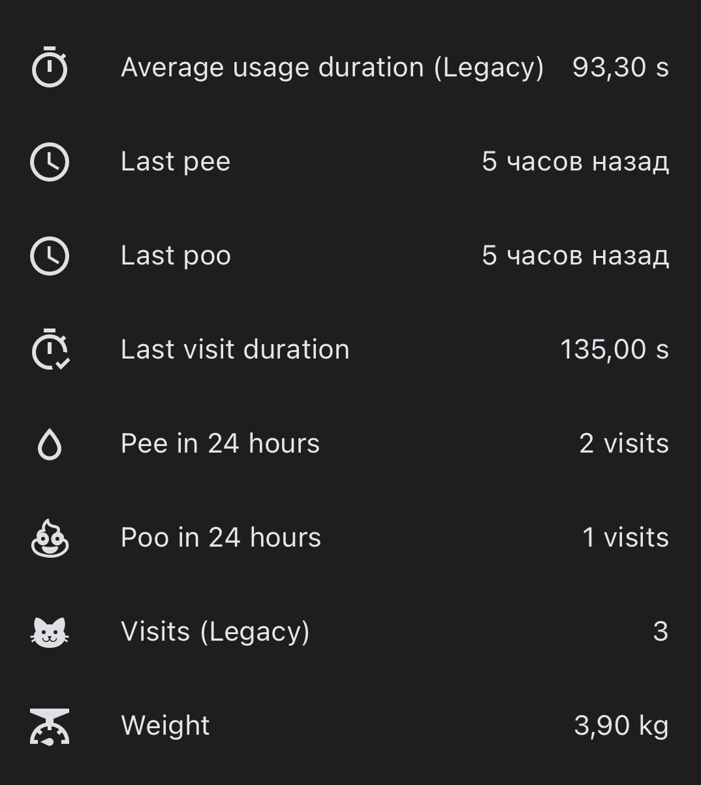
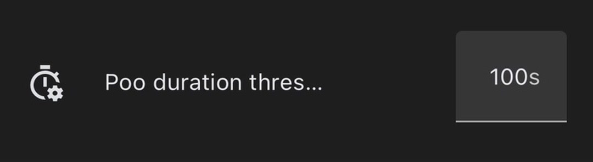
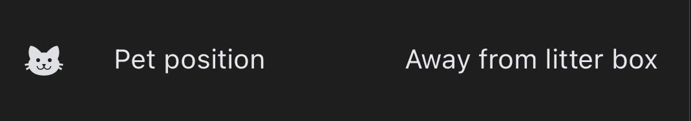

# UPET / Airrobo Cat Litter Box (Multi-Region) for Home Assistant

## EN

Community-maintained Home Assistant integration for UPET / Airrobo smart cat litter boxes. It provides multi-region account login, device telemetry and configuration, per-cat visit analytics, and live MQTT status and controls with integration-side pet-state checks.

Setup includes a country selector and routes requests to the appropriate regional UPET server. In particular, this resolves the misleading **“Authentication failed. Check account and password.”** error affecting accounts whose region is set to Russia. The integration has since grown beyond that original fix with independently calculated Pee/Poo analytics, individual visit duration sensors, confirmed device controls, and decoded live device state.

This project began as a fork because the original integration currently appears to be unmaintained, and attempts to contact its author have not received a response.

A huge thank you to [@CrazzyBerg](https://github.com/CrazzyBerg), the author of the [original integration](https://github.com/CrazzyBerg/upet-hass). They created the foundation that made this project possible. This fork continues and expands that work with multi-region routing, per-cat visit analytics, MQTT controls, and live diagnostics. ❤️

And, of course, thank you to ❤️**UPET / Airrobo**❤️ for creating the hardware and app that inspired this community integration. If your cat needs a smarter throne, please consider supporting the people who made it by choosing an official UPET / Airrobo litter box. 🐈💩

## RU

Развиваемая сообществом пользовательская интеграция Home Assistant для умных кошачьих туалетов UPET / Airrobo. Она поддерживает вход с учётом региона аккаунта, получение данных и настройку устройства, аналитику посещений для каждого питомца, а также управление и отслеживание состояния через MQTT с дополнительной проверкой состояния питомца на стороне интеграции.

При настройке можно выбрать страну, после чего запросы направляются на соответствующий региональный сервер UPET. В частности, это исправляет ошибочное сообщение **«Authentication failed. Check account and password.»**, которое появлялось при использовании аккаунтов с регионом Россия. С тех пор интеграция стала значительно шире первоначального исправления: появились независимо рассчитываемая аналитика Pee/Poo, сенсоры продолжительности отдельных посещений, проверенные команды управления и расшифрованные состояния устройства в реальном времени.

Проект начинался как форк, поскольку оригинальная интеграция, судя по всему, больше не поддерживается, а попытки связаться с её автором остались без ответа.

Огромная благодарность [@CrazzyBerg](https://github.com/CrazzyBerg), автору [оригинальной интеграции](https://github.com/CrazzyBerg/upet-hass). Именно он создал основу, благодаря которой этот проект стал возможен. Форк продолжает и расширяет эту работу: добавляет поддержку нескольких регионов, аналитику посещений для каждого питомца, управление через MQTT и диагностику в реальном времени. ❤️

И, конечно, спасибо ❤️**UPET / Airrobo**❤️ за устройства и приложение, вдохновившие сообщество на создание этой интеграции. Если вашему коту нужен более умный трон, поддержите его создателей, выбрав официальный кошачий туалет UPET / Airrobo. 🐈💩

This integration uses the vendor cloud API for account/device data and the vendor IM/MQTT channel for live work commands and work-state polling.

## Warning

This is an unofficial integration and is not affiliated with, endorsed by, or supported by UPET, Airrobo, or the vendor.

Use it at your own risk. The integration depends on private vendor APIs and may stop working or trigger vendor-side account restrictions at any time. I am not responsible for blocked accounts, lost access, device issues, or any other consequences of using this integration.

For safer use, create a separate UPET/Airrobo account and share litter box access to that account instead of using your primary account.

## Features

- Account login with UPET/Airrobo credentials.
- Country selection and regional API routing during setup.
- Device discovery from the vendor cloud account.
- Read-only box, waste-bin, deodorant, online, and firmware data.
- Cat profile sensors and cat picture URL attributes when returned by the API.
- Per-cat visit analytics with a configurable Poo duration threshold.
- Individual last-visit duration independent of the vendor's legacy daily average.
- Config controls for confirmed settings:
  - Auto clean delay.
  - Auto clean on/off.
  - Deodorant alert.
  - Empty waste-bin reminder switch, time, and weekdays.
  - Do not disturb schedule.
  - Light schedule.
- MQTT work commands:
  - Start clean.
  - Pause clean.
  - Resume clean.
  - Flatten.
  - Pause flatten.
  - Resume flatten.
  - Raise litter rake.
  - Lower litter rake.
  - Request MQTT state.
- Live MQTT work status:
  - Work mode.
  - Work state.
  - Work cause.
  - Pet position: inside the litter box, nearby, or away.
  - Last successful MQTT status update.
- Integration-side pet-state checks before commands that start or resume movement.
- Privacy-preserving structural diagnostics without raw user or device values.
- Local brand icons for supported Home Assistant versions.

## Screenshots

### Per-cat visit analytics

Rolling Pee/Poo counters and last-event timestamps are calculated from individual visits. The most recent visit duration is shown separately from the vendor's legacy daily aggregate.



### Configurable Poo threshold

The Pee/Poo duration threshold can be configured independently for every cat.



### Live pet position

The diagnostic sensor reports whether a pet is inside the litter box, nearby, or away.



## Installation

Install through HACS as a custom repository:

1. Open HACS in Home Assistant.
2. Go to `Integrations`.
3. Open the three-dot menu and choose `Custom repositories`.
4. Add `https://github.com/PnnnG/upet-hass-multi-region`.
5. Select category `Integration`.
6. Install `UPET / Airrobo Cat Litter Box (Multi-Region)`.

Restart Home Assistant after installation.

Manual installation is also possible by copying this repository's
`custom_components/ubpet` directory into your Home Assistant config directory:

```bash
<config>/custom_components/ubpet
```

Add the integration from Home Assistant:

```text
Settings -> Devices & services -> Add integration -> UPET / Airrobo Cat Litter Box (Multi-Region)
```

## Configuration

Required fields:

- `Country`: select the same country that is configured in the official UPET app.
- `Account`: UPET/Airrobo login account.
- `Password`: plain account password. The integration hashes it internally before sending it to the API.

The integration selects the regional API endpoint from the chosen country. It also needs these vendor app/API fields:

- `APP_ID`
- `APP_KEY`
- `PRODUCT`

Bundled app defaults are included with the integration, so normal setup asks
only for country, account, and password. Sensitive app defaults are stored in
obfuscated form to keep raw values out of the repository.

If you maintain a private deployment and want to override the bundled defaults,
use `custom_components/ubpet/secrets.py.example` as a template for a private
`secrets.py`.

## Entities

Device sensors:

- Box status.
- Empty waste-bin reminder days.
- Box use times.
- Waste-bin level.
- Waste-bin last reset.
- Box full max.
- Box full alert.
- Deodorant remaining days.
- Auto clean delay.
- Firmware version.
- Wi-Fi name.
- MQTT work mode.
- MQTT work state.
- MQTT work cause.
- Pet position.
- Last REST update.
- Last MQTT update.

Device binary sensors:

- Online.
- Deodorant expired.
- Sensor enabled.
- Camera enabled.
- Child lock.

Device controls:

- Auto clean delay number.
- Auto clean switch.
- Deodorant alert switch.
- Empty waste-bin reminder switch.
- Empty waste-bin reminder time.
- Empty waste-bin reminder weekday select.
- Do not disturb switch and start/end times.
- Light schedule switch and start/end times.

Device buttons:

- REST request.
- MQTT request state.
- Reset waste-bin counter.
- Start clean.
- Pause clean.
- Resume clean.
- Flatten.
- Pause flatten.
- Resume flatten.
- Raise litter rake.
- Lower litter rake.

Cat sensors:

- Weight.
- Visits (Legacy vendor daily counter).
- Average usage duration (Legacy vendor daily aggregate).
- Last visit duration from the most recent individual usage record.
- Pee in the last 24 hours.
- Poo in the last 24 hours.
- Last Pee timestamp.
- Last Poo timestamp.

Cat configuration:

- Poo duration threshold from 10 to 150 seconds. The default is 100 seconds and it can be configured independently for every cat.

A visit with a duration greater than or equal to the configured threshold is classified as Poo; a shorter visit is classified as Pee. Changing the threshold immediately recalculates the counters and last-event timestamps from locally retained visit data. Visit data and thresholds are stored locally and survive Home Assistant restarts.

The mandatory startup update loads only the latest individual usage record. After Home Assistant reports that startup is complete, the integration loads up to 20 recent records in the background and uses their event timestamps, durations, and cat assignments to initialize the rolling 24-hour counters. Later updates are deduplicated by the vendor record ID. The vendor's daily `Visits (Legacy)` and `Average usage duration (Legacy)` aggregates are displayed as received but are not used for Pee/Poo analytics.

Backfilled records update the current sensor values, but Home Assistant Recorder history is not backdated; after an upgrade, the graph starts when the integration first publishes the calculated values.

Cat picture URLs are exposed as cat entity attributes when returned by the vendor API.

## MQTT Behavior

Work commands are sent through the vendor IM/MQTT path, not REST.

The integration obtains MQTT credentials and topics from the vendor API, publishes command payloads to the IM publish topic, and polls `request_state` for live work status.

The litter box may report `IDLE` work mode together with a raw `RUNNING` state. Command availability therefore follows the decoded work mode and the command-specific state transition instead of treating the raw state alone as authoritative.

Before a command that starts or resumes movement, the integration requests a fresh device state. The command is sent only when the device is ready and reports the pet as away from the litter box. A pet reported inside or nearby, an unknown position, or a missing state response blocks the command. Pause commands remain available without this preflight check so movement can always be stopped.

This software check is an additional safeguard and does not replace the litter box's built-in safety mechanisms or responsible supervision.

Polling intervals:

- `RUNNING`: every 1 second.
- `PAUSED`: every 10 seconds.
- `PENDING`/standby/unknown: every 60 seconds.

MQTT polling starts after Home Assistant finishes setting up the integration, so startup is not blocked by MQTT traffic.

## Confirmed MQTT Commands

Current service ids and operation payload bodies:

| Service id | Meaning | Operation body |
| --- | --- | --- |
| `start_clean_up` | Start clean | `08011001` |
| `pause_clean_up` | Pause clean | `08011002` |
| `resume_clean_up` | Resume clean | `08011003` |
| `start_flatten` | Flatten / smoothing | `08031001` |
| `pause_flatten` | Pause flatten | `08031002` |
| `resume_flatten` | Resume flatten | `08031003` |
| `start_rise` | Raise litter rake | `08071001` |
| `start_drop` | Lower litter rake | `08081001` |

Confirmed operation ordinals:

- `CLEAN = 1`
- `SMOOTHING = 3`
- `RISE = 7`
- `DROP = 8`
- `START = 1`
- `PAUSE = 2`
- `RESUME = 3`

## Limitations

- The integration depends on the vendor cloud and vendor IM/MQTT service.
- Visit analytics depend on the vendor retaining individual usage records. The integration requests the 20 most recent records in the background after startup and retains up to 10,000 imported visits per cat for threshold recalculation and last-event timestamps.
- Commands are confirmed by MQTT delivery/status responses, but full semantic validation of every receipt/error cause is not complete.
- Pet-position command guards depend on the state reported by the device and cannot guarantee physical safety on their own.
- Control board / child lock is currently exposed as read-only because the observed API flow returns a permission error for writes.
- Deodorize, direct light control, camera toggle, and full-alert threshold controls are not implemented yet.

## Development

Run dependency-free tests:

```bash
python3 -m unittest discover -s tests -v
```

Run quick checks:

```bash
python3 -m unittest tests.test_mqtt tests.test_api
python3 -m py_compile custom_components/ubpet/*.py
python3 -m json.tool custom_components/ubpet/strings.json >/tmp/ubpet_strings.json
python3 -m json.tool custom_components/ubpet/translations/en.json >/tmp/ubpet_en.json
python3 -m json.tool custom_components/ubpet/translations/uk.json >/tmp/ubpet_uk.json
```

The current tests cover:

- API signing and password hashing.
- Account type fallback.
- Authenticated request headers.
- Dashboard aggregation.
- Settings payload builders.
- IM credential/contact lookup.
- MQTT codec, packet helpers, RISP/protobuf payload generation, and service ordinals.
- MQTT command availability and pet-position safety states.
- Diagnostics redaction.
- Per-cat visit analytics, configurable thresholds, and the inclusive Poo boundary.

## Implementation Notes

Implemented REST endpoints:

- `PUT /user-service-rest/v2/user/login`
- `GET /user-service-rest/v2/robot/common/device/list`
- `GET /catbox-server/box/config/allConfig?serialNumber=...`
- `GET /catbox-server/box/config/box-use-times/?serialNumber=...`
- `PUT /catbox-server/box/config/box-use-times/reset`
- `GET /catbox-server/app/deodorant-block/status?serialNumber=...`
- `GET /v1/ubtechinc-im-manager/im/online/device/?sn=...`
- `POST /v1/ubtechinc-im-manager/im/login`
- `GET /v1/ubtechinc-im-manager/im/friends`
- `GET /catbox-server/web/cat/info`
- `POST /catbox-server/web/box/record/new`
- `PUT /catbox-server/box/config/switch/update`
- `PUT /catbox-server/box/config/timePeriod/update`
- `PUT /catbox-server/box/config/timePoint/update`
- `POST /catbox-server/app/deodorant-block/switch`

MQTT command format:

```text
Message -> MessageContent(custom) -> Any(BytesValue) -> CommandProto(protype=2) -> RISP frame -> AirPet protobuf body
```

MQTT state request uses RISP command `0x3fd`. Operation commands use RISP command `0x3fb`.

## Roadmap

Planned or open work:

- Decode more MQTT receipt/error causes and surface command failures more clearly.
- Implement deodorize command if available.
- Implement full-alert threshold setting.
- Implement writable control board / child lock if a permitted API flow is found.
- Add Home Assistant platform tests with `pytest-homeassistant-custom-component`.
